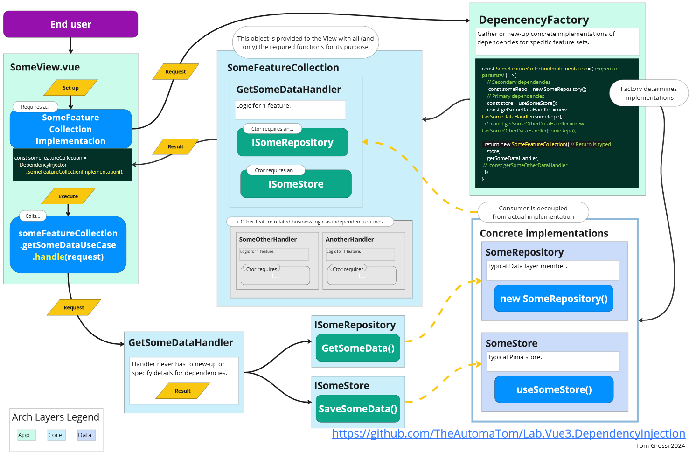

# lab-vue3-di-testing

The intention of this repository is to examine how Dependency Injection can be implemented in a Vue app.  My primary experience as a .Net developer had me wondering how Mediator-style handlers could be added, and how to decouple Pinia stores with TS interfaces.  The result is a factory called by Views to ask for a set of specific handlers as they are requested by end users.

Lots of thanks and credit to [this article](https://medium.com/@victormisiko.vm/implementing-clean-architecture-in-a-vue-js-application-fd23b33ef488)!  Reverse engineering your hard work was a thrilll.